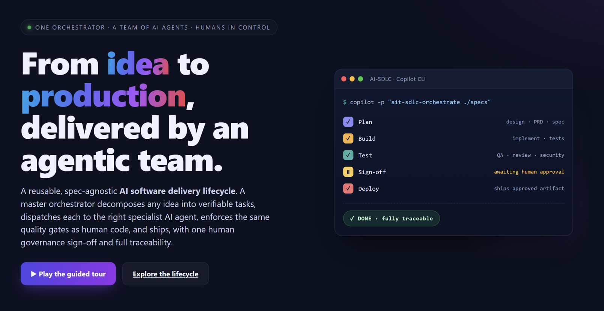
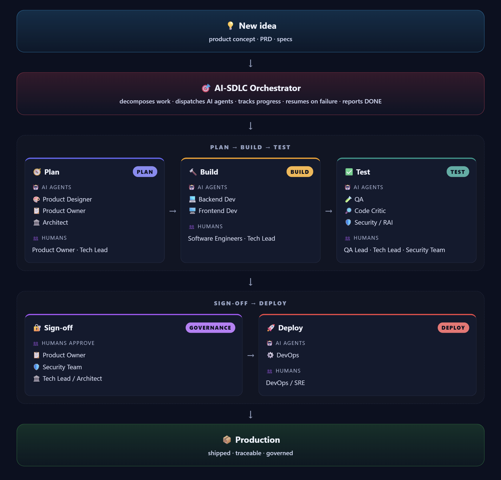

# AI-Team SDLC — Agentic Software Delivery System



> **▶ [View the live executive presentation](https://calinl.github.io/ai-team-sdlc/demo/ai-sdlc-lifecycle.html)** — an interactive, animated walkthrough of the whole agentic lifecycle (published via GitHub Pages). Prefer a static view? See the [high-resolution poster](docs/demo/ai-sdlc-lifecycle-poster.png).

A reusable, spec-agnostic **agentic SDLC**, packaged as a **GitHub Copilot plugin**: a master
orchestrator turns any product idea or spec into shipped software by decomposing the work into
verifiable tasks, dispatching each to the right specialist AI agent, enforcing quality gates,
keeping a resumable record of progress, and reporting `DONE` only when every task passes its
gate — with one human governance sign-off.

It is **portable** across VS Code Copilot and the Copilot CLI. The team ships as `ait-` specialist
agents and skills; their shared operating contract travels with them in the `ait-conventions`
skill, so the system behaves identically in any repo that installs the plugin.

## The lifecycle

```
ideate → prototype (UI only) → PRD → spec → implement → test (QA + critic + security)
       → human sign-off → deploy
```

Every stage is owned by an AI agent (namespaced `ait-`) with humans in the loop, and a single
mandatory human governance sign-off before deploy.



## Install (Copilot plugin)

Install from the marketplace, then enable the plugin:

```bash
copilot plugin marketplace add CalinL/ai-team-sdlc
copilot plugin install ai-team-sdlc@ai-team-sdlc
```

That's it — the team works immediately. The orchestrator auto-creates its runtime tracking store
on the first run, so **no setup step is required**.

Optionally, make adoption explicit in a repo with the one-time `ait-init` skill (it enables the
plugin declaratively, drops a thin `AGENTS.md` pointer, and git-ignores the tracking store — it
never copies the agents or skills into your repo):

```bash
copilot -p "Use the ait-init skill to set up this repo"
```

> **The path:** install the plugin → *(optional)* run `ait-init` → the repo is an agentic SDLC workspace.

## Why it wins

- **One team, idea to production.** A single orchestrator drives ideation, prototyping, specs, build, test, sign-off, and deploy — no hand-offs lost between tools.
- **Quality gates on every task.** AI-authored code passes the *same* build, lint, unit, acceptance, critic-review, and security gates as human code. A task is `DONE` only when every required gate passes.
- **Resumable by design.** Runs persist canonical state, skip finished work, recover from crashes, and never redo what's done — so long jobs survive interruptions.
- **One human governance sign-off.** Product Owner, Security, and Tech Lead approve before deploy; agents never self-approve. Control without micromanaging.
- **Portable.** Install once; it works across VS Code Copilot and the Copilot CLI, in any repo, with zero in-repo duplication.
- **Transparent.** Every decision and file change is tracked in an auditable, append-only history.

## The AI agents at a glance

| Agent | Role | Phase | Invoke via |
|---|---|---|---|
| `ait-sdlc-orchestrator` | Decomposes work, dispatches specialists, enforces gates, reports `DONE` | All | `/product-run` |
| `ait-product-designer` | User journeys, UX flows, wireframes, clickable prototype | Plan | `/product-design`, `/product-prototype` |
| `ait-product-owner` | PRD, acceptance criteria, scope and priorities | Plan | `/product-specs` |
| `ait-architect` | Architecture, API contracts, data models, technical specs | Plan | `/product-specs` |
| `ait-backend-dev` | Server logic, APIs, data, persistence, backend tests | Build | `/product-implement` |
| `ait-frontend-dev` | UI, client state, routes, accessibility, frontend tests | Build | `/product-implement` |
| `ait-qa-test` | Test plans, acceptance verification, regression evidence | Test | `/product-qa` |
| `ait-code-reviewer` | Critical review for blocking correctness and maintainability defects | Test | `/product-review` |
| `ait-security-rai` | Secrets, SAST, dependency/SCA, and Responsible-AI validation | Test | `/product-security` |
| `ait-devops` | Release, deployment, rollback planning (after sign-off) | Deploy | `/product-deploy` |
| `ait-scribe` | Consolidates decisions and file-change history | All | *(automatic)* |

Two more skills underpin the team: **`ait-conventions`** (the shared contract — tracking store,
task schema, gates, resumability, sign-off) and **`ait-quality-gates`** (the reusable gate library).

## Commands (phases → skills)

| Command | Skill | Specialist agent |
|---|---|---|
| `/product-design` | `ait-product-design` | Product Designer |
| `/product-prototype` | `ait-product-prototype` | Product Designer |
| `/product-specs` | `ait-tech-specs` | Product Owner, Architect |
| `/product-implement` | `ait-implementation` | Backend / Frontend Dev |
| `/product-qa` | `ait-qa-validation` | QA / Test |
| `/product-review` | `ait-review-critic` | Code Reviewer / Critic |
| `/product-security` | `ait-security` | Security / RAI |
| `/product-deploy` | `ait-deploy` | DevOps |
| `/product-run` | `ait-sdlc-orchestrate` | Orchestrator + Scribe |

The `/product-*` commands are VS Code Copilot slash-command wrappers. In the Copilot CLI, invoke
the underlying `ait-*` skill directly (below).

## Using the team

The same `ait-*` skills and agents power all three surfaces — only the invocation gesture differs.

### Copilot CLI

```bash
# One-time: install the plugin
copilot plugin marketplace add CalinL/ai-team-sdlc
copilot plugin install ai-team-sdlc@ai-team-sdlc

# Full lifecycle from a spec (folder, file, or pasted idea)
copilot -p "Use the ait-sdlc-orchestrate skill. Specs: ./specs/. Run the full SDLC and report DONE."

# Resume an interrupted run (nothing finished is redone)
copilot -p "Use the ait-sdlc-orchestrate skill. Resume run .copilot-tracking/2026-07-22-checkout/."

# Single phase — call the matching skill directly
copilot -p "Use the ait-product-design skill to shape UX flows for ./specs/checkout.md"
copilot -p "Use the ait-product-prototype skill to build and verify a clickable prototype from ./specs/checkout.md"
copilot -p "Use the ait-tech-specs skill to turn the approved prototype into API contracts + acceptance criteria"
copilot -p "Use the ait-implementation skill to build task T-003 from .copilot-tracking/<run>/tasks.md"
copilot -p "Use the ait-qa-validation skill to verify acceptance criteria for the checkout feature"

# Optional: wire the plugin into a fresh repo (settings + AGENTS.md pointer + gitignored tracking)
copilot -p "Use the ait-init skill to set up this repo"
```

### VS Code Copilot

Run a `/product-*` slash command in Copilot Chat; each is a thin router that loads the matching
skill and persona. Input comes from the text after the command, the current selection
(`${selection}`), or the open file (`${file}`).

```text
/product-run        ./specs/checkout.md         → full lifecycle, pauses for sign-off
/product-design     a mobile checkout flow      → ideation: journeys, UX flows, tokens
/product-prototype                              → clickable prototype (uses ${file}/${selection})
/product-specs                                  → PRD + API contracts + acceptance criteria
/product-implement                              → build the next ready task
/product-qa    ·    /product-review    ·    /product-security
/product-deploy                                 → release (after human sign-off)
```

Or open the agent picker and choose a persona directly (e.g. **ait-sdlc-orchestrator**,
**ait-product-designer**, **ait-backend-dev**) and describe the task in your own words.

### Copilot app / coding agent

Enable the plugin once — from the plugin manager (add marketplace `CalinL/ai-team-sdlc`, then
install), or declaratively in `.github/copilot/settings.json`:

```json
{ "enabledPlugins": ["ai-team-sdlc@ai-team-sdlc"] }
```

Then just describe the goal in a session — skills activate by description, no slash command needed:

```text
Take ./specs/checkout.md through the full SDLC and stop for sign-off before deploy.
Prototype the onboarding screen, then review it for accessibility issues.
```

## Executive presentation

`docs/demo/ai-sdlc-lifecycle.html` is a self-contained, animated executive walkthrough of the
agentic lifecycle. It is published to **GitHub Pages** and linked at the top of this README:

- Live: <https://calinl.github.io/ai-team-sdlc/demo/ai-sdlc-lifecycle.html>
- Static poster: [`docs/demo/ai-sdlc-lifecycle-poster.png`](docs/demo/ai-sdlc-lifecycle-poster.png)

> The workflow (`.github/workflows/deploy-pages.yml`) auto-enables GitHub Pages (`enablement: true`)
> and publishes `docs/` on every push to `main`. If your org blocks automatic enablement, set
> **Settings → Pages → Source: GitHub Actions** once, then re-run the workflow from the **Actions** tab.

## Repo layout

| Path | What |
|---|---|
| `plugins/ai-team-sdlc/plugin.json` | Plugin manifest |
| `plugins/ai-team-sdlc/skills/` | 16 skills, incl. `ait-conventions` (the contract) and `ait-init` (setup) |
| `plugins/ai-team-sdlc/agents/` | 11 specialist agent personas |
| `plugins/ai-team-sdlc/prompts/` | `/product-*` slash commands (VS Code convenience) |
| `.github/plugin/marketplace.json` | Marketplace registration |
| `.github/workflows/deploy-pages.yml` | Publishes the executive demo to GitHub Pages |
| `AGENTS.md` | Portable onboarding / CLI entry (points at the `ait-conventions` skill) |
| `docs/` | Design, usage, and bootstrap docs |
| `docs/demo/ai-sdlc-lifecycle.html` | Self-contained animated executive demo |
| `docs/demo/ai-sdlc-lifecycle-poster.png` | High-resolution poster export of the demo |

See `docs/ai-sdlc-design.md` for the full design and diagrams, and `docs/ai-sdlc-usage.md`
for command usage.
