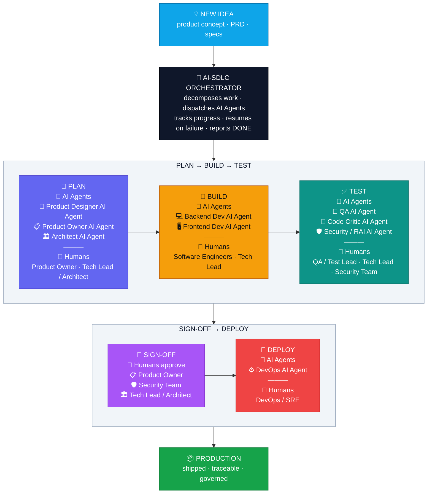
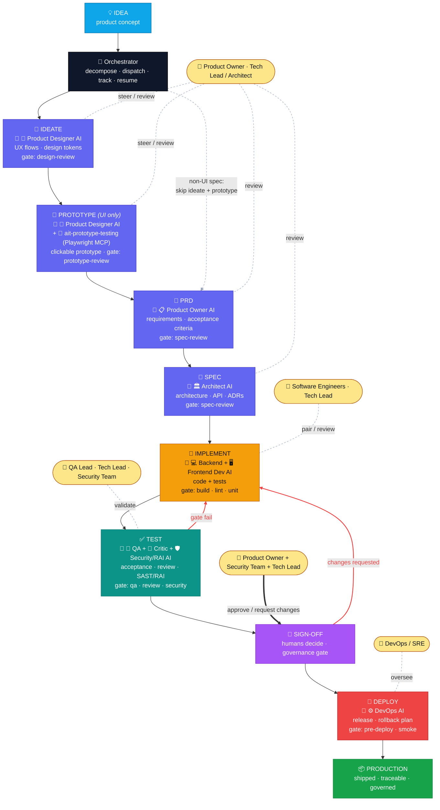
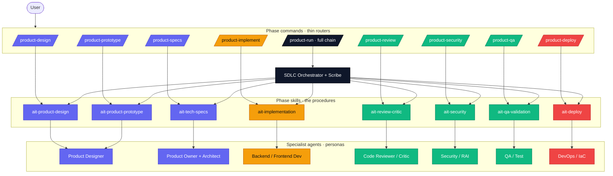
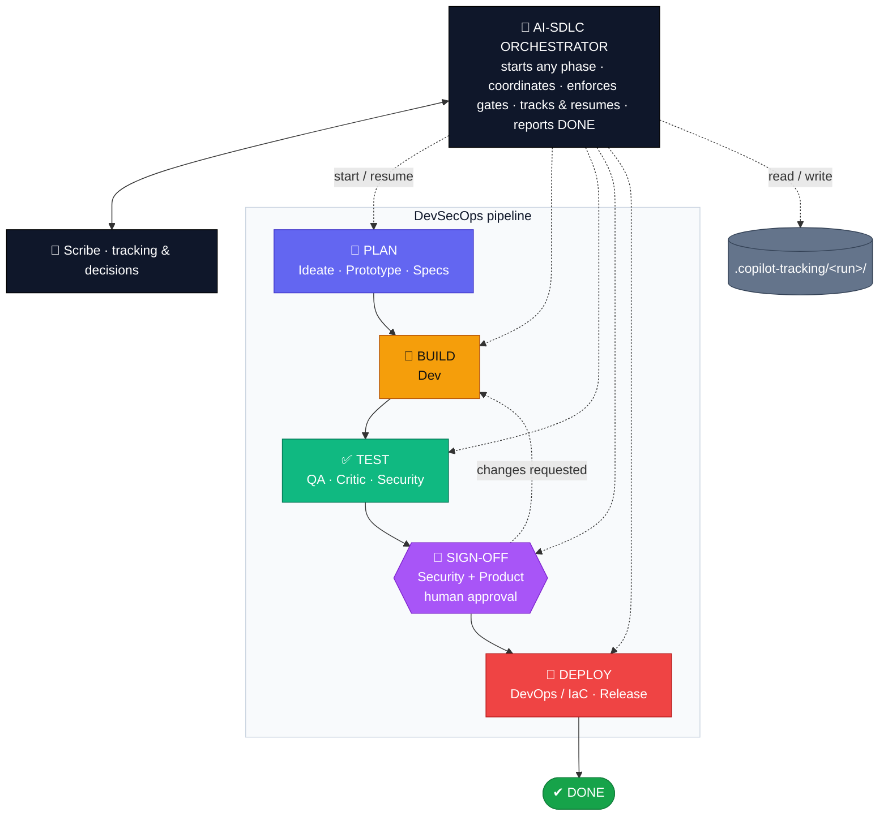
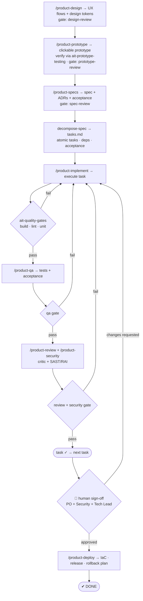
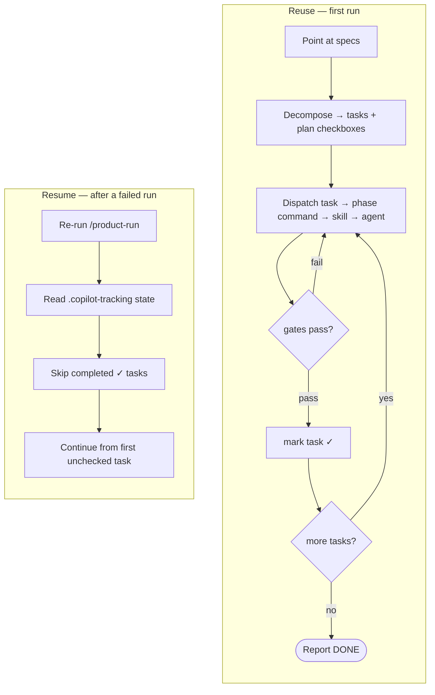

# AI‑SDLC — Reusable Agentic System (Design: Phases 1 & 2)

> A reusable, **spec‑agnostic** agentic SDLC system: phase **commands** (thin routers) drive per‑phase **skills** (the procedures) executed by specialist **agents** (personas), coordinated by a master **orchestrator** with resumable tracking and quality gates. Point it at any specs later and it decomposes → executes → verifies → reports `DONE`. Portable across VS Code Copilot and Copilot CLI.

---

## Executive Overview — Agentic SDLC for building new products

**The idea:** a single **AI Orchestrator** conducts a team of specialist **AI agents** that take a new product idea all the way to production — designing, building, testing, and shipping autonomously — while humans stay in control at one **governance sign‑off**. Work is fully tracked, so a run can pause or fail and resume without losing progress.



> **Rendering note:** the `PLAN → BUILD → TEST` and `SIGN-OFF → DEPLOY` boxes stay horizontal because the flow connects at the *box* level (`ORCH → BUILDIT → SHIPIT → PROD`). Linking an outside node straight to an inner node (e.g. `ORCH → PLAN`) makes Mermaid override the box's `direction LR` and stack it vertically.

**Why it matters:** faster idea‑to‑market, consistent quality gates on every change, security & responsible‑AI checks built in, one human approval before anything ships, and full traceability of what each AI Agent did — **with humans still in the loop at every phase.**

| Phase | 🤖 AI Agents | 👥 Humans in the loop | Outcome |
|---|---|---|---|
| 🧭 **Plan** | Product Designer · Product Owner · Architect | Product Owner · Tech Lead/Architect | Design direction + verified prototype + agreed spec |
| 🔨 **Build** | Backend Dev · Frontend Dev | Software Engineers · Tech Lead | Working code |
| ✅ **Test** | QA · Code Critic · Security/RAI AI Agents | QA / Test Lead · Tech Lead · Security Team | Reviewed, secure, validated against acceptance criteria |
| 🔐 **Sign‑off** | *(humans decide)* | Product Owner · Security Team · Tech Lead | Governance approval to ship |
| 🚀 **Deploy** | DevOps AI Agent | DevOps / SRE | Released safely, with rollback |

*(Engineering detail — commands, skills, file paths, tracking schema — follows in Phase 2 below.)*

### How it works — end to end

1. **Kick off with an idea.** A human points the system at a new product idea, PRD, or spec — no need to break it down first.
2. **The Orchestrator takes over.** The AI‑SDLC Orchestrator reads the idea, **decomposes it into small, ordered tasks** with clear acceptance criteria, and writes them to a tracking file so nothing is lost.
3. **Plan.** The Product Designer, Product Owner, and Architect AI Agents turn the idea into a **verified prototype (for UI work), a PRD, and an agreed technical spec**. Humans (Product Owner, Tech Lead) review and steer.
4. **Build.** The Backend and Frontend Dev AI Agents **write the code**. Every change must pass automated **quality gates** (build, tests, lint) — the same gates a human's code would.
5. **Test.** The QA, Code Critic, and Security/RAI AI Agents **validate the work against the acceptance criteria, review it for blocking defects, and run security/RAI checks**. If something fails, the Orchestrator sends it back to Build automatically.
6. **Human sign‑off (governance gate).** Nothing ships on AI's say‑so. **Product Owner, Security Team, and Tech Lead review and approve** — or request changes, which loop back to Build.
7. **Deploy.** Once approved, the DevOps AI Agent **releases safely**, with a rollback plan, overseen by DevOps/SRE.
8. **Production.** The result is a shipped feature that is **traceable** (who/what did each step) and **governed** (passed every gate and the human approval).

**Runs are resumable.** Because progress is tracked at each step, a run can pause or fail and later **pick up exactly where it left off** — finished tasks are never redone. Teams can run the **whole chain at once** or invoke a **single phase** (e.g. just prototype a feature) on demand.

### Full lifecycle — AI agents ↔ human personas

Every stage pairs an **AI agent** (does the work) with the **humans in the loop** (steer, review, approve). The spine runs `idea → ideate → prototype (UI only) → PRD → spec → implement → test → sign‑off → deploy`; dotted lines are human interactions, red lines are feedback loops.



> **Interactive demo:** an animated, clickable walkthrough of this lifecycle (guided tour, per‑stage
> AI‑agent + human personas, gates, and feedback loops) lives at
> [`docs/demo/ai-sdlc-lifecycle.html`](demo/ai-sdlc-lifecycle.html) — a self‑contained, offline‑ready
> HTML file for executive presentation. Verified in‑browser via the Playwright MCP (`ait-prototype-testing`).

---

## Phase 1 — Research (read‑only)

Sources consulted: the *Governed AI‑SDLC Plan* (githubabcs/gh‑abcs‑admin), `github/awesome-copilot`, `bradygaster/squad`, `microsoft/hve-core`, `github/spec-kit`, and the `anthropics/microsoft/dotnet` skills repos. (`microsoft/apm` is SAML‑locked; its role — versioned agent distribution — is noted conceptually.)

### Patterns extracted → mapped to a component

| # | Pattern | Source | Maps to |
|---|---------|--------|---------|
| 1 | **RPI loop** — Research → Plan → Implement → Review, each in fresh context | microsoft/hve-core | Orchestrator loop |
| 2 | **Difficulty‑gated execution** — Simple = direct; Challenging = artifacts + subagents | hve-core `rpi-agent` | Orchestrator dispatch (no over‑engineering) |
| 3 | **Spec‑Driven flow** — constitution → specify → clarify → plan → tasks → analyze → implement | github/spec-kit | Task‑decomposition format |
| 4 | **Checkbox tracking `[ ]/[x]` + date‑namespaced artifacts** — filesystem *is* the state | hve-core `.copilot-tracking/` | Tracking / resumability |
| 5 | **Inbox + Scribe merge** — agents write isolated files; Scribe consolidates `decisions.md` | bradygaster/squad `.squad/` | Tracking + Scribe role |
| 6 | **Declared subagent graph + typed handoffs** (`agents:` / `handoffs:` frontmatter) | hve-core, squad | Orchestrator ↔ specialist wiring |
| 7 | **Thin harness / fat skills + resolver** — judgment in markdown skills, routed by `description` | Garry Tan (governed plan §5B.5) | Command → skill → agent model |
| 8 | **Quality gates = agent code passes the SAME gates as human code** | GitHub WellArchitected | Quality gates |
| 9 | **Progressive‑disclosure skills** (metadata → body → resources) | anthropics / microsoft / dotnet skills | Portable primitives |

### Primitive conventions (confirmed)

| Primitive | Location | Key frontmatter | Portable? |
|---|---|---|---|
| Agent | `.github/agents/<name>.agent.md` | `name`, `description`, `model`, `tools[]`, `agents:[]`, `handoffs:[]` | VS Code + CLI (via plugin) |
| Skill | `.github/skills/<name>/SKILL.md` | `name` (kebab), `description` (when / when‑not) | **VS Code + CLI** (via plugin) |
| Prompt (command) | `.github/prompts/<name>.prompt.md` | `mode`/`agent`, `description`, `tools[]` | VS Code slash‑command |
| Instructions | `.github/instructions/<name>.instructions.md` | `description`, `applyTo` glob | VS Code |
| Onboarding | `AGENTS.md` (root) | free‑form | **CLI** (read by CLI runtimes) |

**Key portability finding:** only **Skills** and **`AGENTS.md`** are read by *both* surfaces today. Therefore the real logic lives in Skills; commands/agents are thin, surface‑specific wrappers, and `AGENTS.md` documents CLI invocation.

---

## Phase 2 — System Design

### Design principle — command‑driven, thin router → fat skill → persona

Each phase is entered by a slash **command** (a thin router that knows *which* skill + agents to load). The **skill** carries the reusable procedure. The **agent** is the persona that runs it. The **orchestrator** can run a single phase or chain all of them with gates and resumable tracking.



Colors match the pipeline: 🟦 Plan · 🟧 Build · 🟩 Test · 🟥 Deploy · ⬛ Orchestrator.

### The AI‑SDLC team — Orchestrator on top, DevSecOps pipeline left → right

The **AI‑SDLC Orchestrator** sits on top and can start (or resume) any phase. Beneath it the phases run as a color‑coded **DevSecOps pipeline** flowing left → right: **Plan → Build → Test → Sign‑off (human approval) → Deploy**. The Sign‑off gate is a human‑in‑the‑loop Security + Product approval before anything ships.



**Phase → command → agents:**

| Phase | Commands | Agents |
|---|---|---|
| 🧭 **Plan** | `/product-design`, `/product-prototype`, `/product-specs` | Product Designer · Product Owner · Architect |
| 🔨 **Build** | `/product-implement` | Backend/Frontend Dev |
| ✅ **Test** | `/product-qa`, `/product-review`, `/product-security` | QA / Test · Code Reviewer/Critic · Security/RAI |
| 🔐 **Sign‑off** | *(human approval gate)* | Product Owner + Security Team + Tech Lead approve/reject |
| 🚀 **Deploy** | `/product-deploy` | DevOps / IaC |
| ♾️ **All** | `/product-run` | Orchestrator + Scribe (runs every phase with gates) |

### Phase pipeline with quality gates



### Reuse flow & resume‑on‑failure



### Components, file paths & types

| # | Component | Path | Type | Portable |
|---|-----------|------|------|:---:|
| 1 | Phase commands | `plugins/ai-team-sdlc/prompts/product-{design,prototype,specs,implement,review,security,qa,deploy,run}.prompt.md` | Prompt | VS Code |
| 2 | Phase skills | `plugins/ai-team-sdlc/skills/{ait-product-design,ait-product-prototype,ait-tech-specs,ait-implementation,ait-review-critic,ait-security,ait-qa-validation,ait-deploy}/SKILL.md` | Skill | ✅ |
| 3 | Orchestrator skill (decompose + dispatch + track + resume) | `plugins/ai-team-sdlc/skills/ait-sdlc-orchestrate/SKILL.md` | Skill | ✅ |
| 4 | Shared gate library | `plugins/ai-team-sdlc/skills/ait-quality-gates/SKILL.md` | Skill | ✅ |
| 4b | Design toolkit (vendored/adapted, Apache-2.0) | `plugins/ai-team-sdlc/skills/{frontend-design,theme-factory,web-artifacts-builder,ait-prototype-testing}/SKILL.md` + `NOTICE.md` | Skill | ✅ |
| 5 | Specialist personas | `plugins/ai-team-sdlc/agents/{ait-sdlc-orchestrator,ait-product-designer,ait-product-owner,ait-architect,ait-backend-dev,ait-frontend-dev,ait-devops,ait-qa-test,ait-code-reviewer,ait-security-rai,ait-scribe}.agent.md` | Agent | ✅ |
| 6 | Shared conventions (contract) | `plugins/ai-team-sdlc/skills/ait-conventions/SKILL.md` | Skill | ✅ |
| 6b | Repo setup (optional) | `plugins/ai-team-sdlc/skills/ait-init/SKILL.md` | Skill | ✅ |
| 7 | Portable onboarding / CLI entry | `AGENTS.md` | Doc | ✅ CLI |
| 8 | Usage doc | `docs/ai-sdlc-usage.md` | Doc | ✅ |
| 9 | Runtime tracking store | `.copilot-tracking/<run>/` (git‑ignored) | State | ✅ |

### Tracking / resumability schema

Per run, `.copilot-tracking/<YYYY-MM-DD-slug>/`:

| File | Purpose |
|---|---|
| `state.json` | Machine‑readable run state — **canonical** source of truth (tasks, gates, sign‑off) |
| `plan.md` | Phases/tasks as `[ ]/[x]` checkboxes — human‑readable projection of `state.json` |
| `tasks.md` | Atomic tasks: `id`, `owner`, `phase`, `deps`, `acceptance`, `requiredGates`, `gateResults`, `status` |
| `changes.md` | Append‑only change log (Scribe‑merged) |
| `decisions.md` | Scribe‑merged decisions/ADRs (from per‑agent inbox writes) |
| `inbox/` | Isolated per‑agent write files (`inbox/processed/` once consolidated) |

**Resume =** read `state.json` (canonical), skip `done`, re‑run any `in_progress`, continue at the
first ready task — no finished work redone.

### Proposed file tree

```
.github/
  prompts/
    product-design.prompt.md      product-prototype.prompt.md
    product-specs.prompt.md       product-implement.prompt.md
    product-review.prompt.md      product-security.prompt.md
    product-qa.prompt.md          product-deploy.prompt.md
    product-run.prompt.md
  skills/
    ait-product-design/SKILL.md       ait-product-prototype/SKILL.md
    ait-tech-specs/SKILL.md           ait-implementation/SKILL.md
    ait-review-critic/SKILL.md        ait-security/SKILL.md
    ait-qa-validation/SKILL.md        ait-deploy/SKILL.md
    ait-sdlc-orchestrate/SKILL.md     ait-quality-gates/SKILL.md
    # design toolkit (vendored/adapted, Apache-2.0 — support the Plan phase)
    frontend-design/SKILL.md      theme-factory/SKILL.md
    web-artifacts-builder/SKILL.md ait-prototype-testing/SKILL.md
    NOTICE.md                     # attribution for vendored skills
  agents/
    ait-sdlc-orchestrator.agent.md    ait-scribe.agent.md
    ait-product-designer.agent.md     ait-product-owner.agent.md
    ait-architect.agent.md            ait-backend-dev.agent.md
    ait-frontend-dev.agent.md         ait-devops.agent.md
    ait-qa-test.agent.md              ait-code-reviewer.agent.md
    ait-security-rai.agent.md
  instructions/
    ai-sdlc.instructions.md
AGENTS.md
docs/
  ai-sdlc-usage.md
.copilot-tracking/                # runtime state (add to .gitignore)
```

**Roster:** 9 commands · 14 skills (11 namespaced core + 3 unprefixed vendored) · 11 agents · 1 instructions · `AGENTS.md` · usage doc, organized into 5 phases (Plan · Build · Test · Sign-off · Deploy) + Orchestrator.

---

*Phases 1–2 (research + design) are captured above. Phase 4 (scaffold) is **built** — the file
tree above exists under `.github/` with `AGENTS.md` and `docs/ai-sdlc-usage.md`.*
